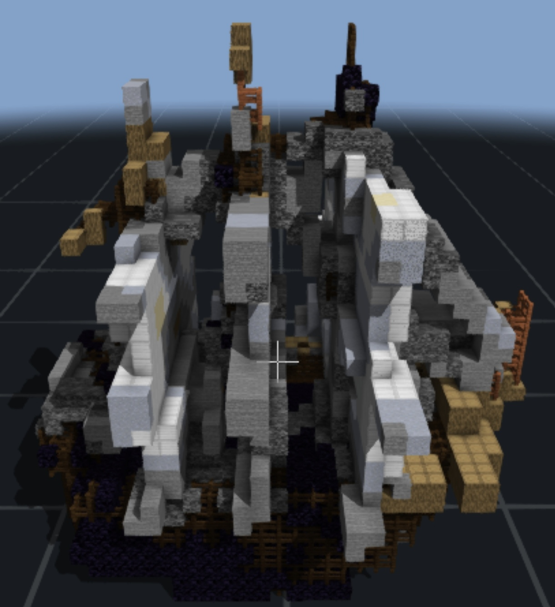
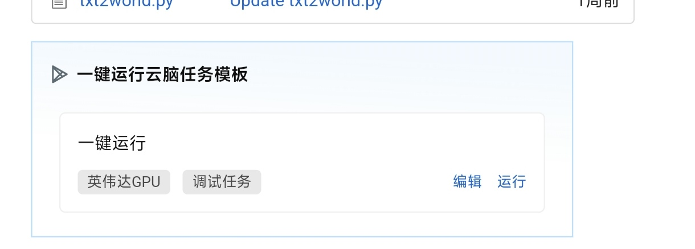
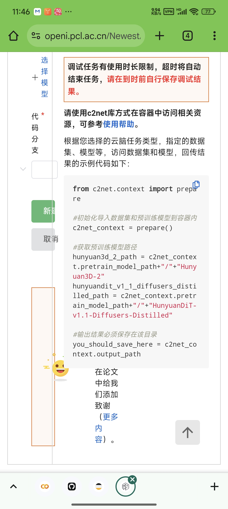
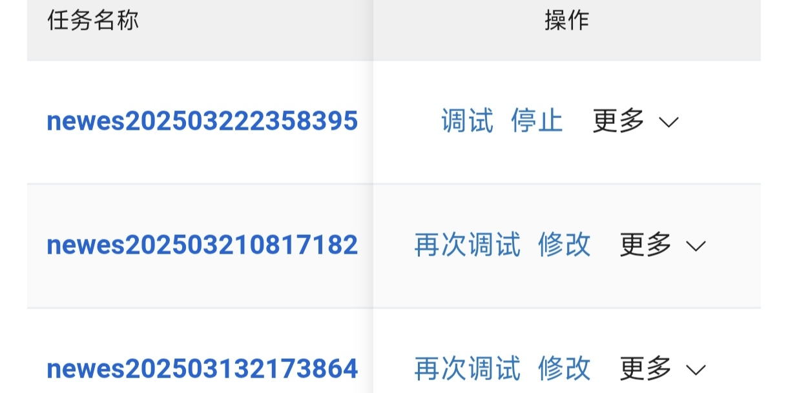
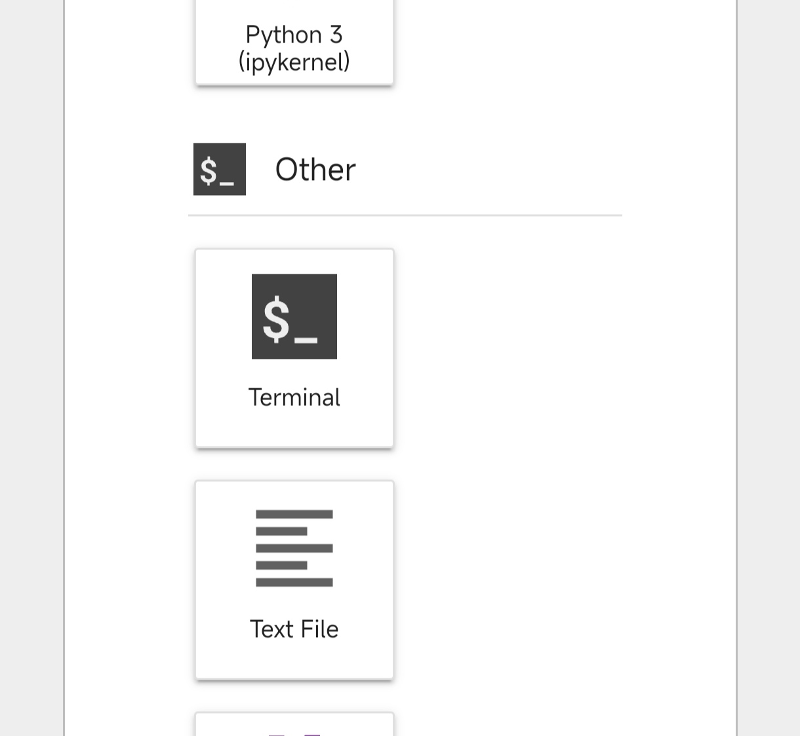

这个项目是我用半年时间，在手机上完成的。它能够通过自然语言生成 Minecraft 建筑，实现从文本描述到 AI 生成 3D 模型，再到自动体素化，最终生成 Minecraft Schematic 文件的全流程自动化。
[](https://www.youtube.com/watch?v=KD9u1QGffM4)
## 项目背景

我从小就沉迷于 Minecraft，初中开始在 YouTube 上观看国外视频自学 Python。虽然时间有限，只学到了一些零散的知识，但我更喜欢折腾系统。初中时，我与 Python 的接触时间非常少，后来电脑也被我折腾坏了。我只能在手机上勉强自学编程。Termux 对 Python 的兼容性很差，我只能使用 Colab 和 Kaggle 运行 Python 环境，后来我逐渐爱上了机器学习。

你可以点击我的头像查看我的 LinuxDo 主页，你会看到我去年发布了一些白嫖云电脑部署开源模型的教程，例如 flux.1、CogVideo 和 VideoReTalking。但是这些都是已经训练好的模型。后来我玩 Minecraft 时心血来潮，想训练一个自己的 Minecraft 模型，实现一句话让 AI 生成 Minecraft 建筑物。

然而，想要自己一个人从零开始训练一个 AI 模型，并非易事。模型训练不是请客吃饭。我只能到网上四处搜集资料。我阅读了大量的计算机科学论文，希望找到成功的案例可以参考，但不幸的是，一个也没有找到。网上只有文本到 3D 点云的 AI 模型，而训练一个 Minecraft 生成建筑物的模型，应该要训练一个文本到体素模型的模型，与网上的 AI 生成 3D 模型根本不是同一个领域。

于是，我请教了 GPT-4o 和 Claude，它们结合我的想法帮我写了一个不完整的框架。我复制粘贴到 Colab 测试，结果遇到了各种报错。我把报错的内容复制粘贴发给 GPT，有很多错误 AI 都不能解决（例如很多库都更新了，AI 还在用旧版库的模块，还反过来说我的库太旧了让我更新，或者是因为模型幻觉乱定义函数，或者就是 Colab 环境本身自带很多库，如果我安装新的库会导致和一些旧的库冲突等等），这困扰了我很久，让我长夜难眠。

但这并没有阻止我写好项目的决心。我榨干了自己的每一分每一秒时间投入到了这上面，一个一个错误被解决了。一个月过去了，我的项目终于可以训练了，这时我才想起来，我根本没有数据集。怎么办？自己去 Minecraft 造 10 万个房子拿去训练吗？想想都觉得不现实。那就让 AI 生成建筑物，然后去训练？问题是 AI 会生成建筑物，我还需要训练 AI 模型干嘛？于是项目到这里就碰壁了。

我重新整理资料，让 Gemini 新发布的 Thinking 模型和 LinuxDo 佬友 "ky" 的 DeepSeek-R1-Lite 模型帮我想了一个新思路。不过当时 DeepSeek-R1 还没发布正式版，Lite 版本的上下文非常有限，Gemini 的 Thinking 模型的上下文也只有 30k tokens 左右，而我准备的资料（比如自己在 GitHub 整理的关于 AI 和 Minecraft 相关的论文和代码以及一些冷门的 Python 库的源代码，比如 NBT）的 tokens 占用远远超过这个。我只能疯狂压缩资料的内容，或者问 AI 一些零零散散的问题。最终 AI 建议我去微调 OpenAI 在 2023 年发布的 Shap-E 模型。这是一个轻量的文本生成 3D 模型的模型，15GB 显存就可以运行，虽然质量比较堪忧，但是最终还是要转换成体素模型，所以不必太在乎质量。

首先冻结大部分层，保留原本的 NLP，然后拿自己的数据集微调训练。既然是微调，数据集少一点也没关系。我就拿自己昔日的 Minecraft 建筑地图里的建筑物导出成了 Schematic 文件，用 NBT 库解析成了文本，然后用 Groq 生成描述。一顿操作猛如虎，又是一个多月过去了，数据集有了。首先要把描述文本转成 token 张量，也就是微调 NLP 的 token IDs。结果一上来就遇到了形状不匹配之类的报错，我忘了具体是什么。我记得 shape 用的 NLP 好像是 CLIP。对于微调文本处理的报错，我又研究了几天，终端终于没有出现报错日志，我都快感动哭了。

接下来就是测试微调 Minecraft Schematic 文件了。一上来，终端就送了我一份报错大礼，它说形状和结构不匹配，说我的结构不统一。然后我问了 AI，AI 建议我把我的 Minecraft 建筑物结构都裁剪成 16x16x16。于是我只好重新处理数据集，又浪费了一天时间。重新处理好数据集后，终端又报错，说我的数据集形状与 Shap-E 模型的形状不匹配。到这一步，AI 也不知道怎么办了。Gemini 2.0 Flash Thinking, DeepSeek R1-Lite, o1-preview，三五天都没帮我解决，项目再一次碰壁了。

过了几天，我发现网上就有一个开源的 AI 生成 Minecraft Schematic 的模型，但是没有集成 NLP，也就没法用文本生成 Schematic，而是 AI 自己发挥，通过空间随机生成。我要做的是给它安装一个文本处理 NLP 就可以实现文本生成 Minecraft Schematic 了。乍一听还挺容易，结果我才发现这个模型是 11×11×11 的建筑结构训练来的，而且零样本推理的质量非常差。一个月过去了，各种错误和维度不匹配、形状不匹配，全部被我解决了，终于是硬着头皮写完了微调训练脚本，感觉就要迎来胜利的曙光。结果到了推理的时候，发现根本就不听从文本的指示，生成出来的东西完全没法看，不知道是数据集不够，还是推理脚本有问题，还是训练脚本有问题，自己打算放弃了。

过了几天，我重新整理了一下思路，发现自己把事情想得太复杂了。其实这种东西，只要把普通的 3D 模型转换成体素模型，然后把每一个体素模型的方块都换成 Minecraft 的方块不就好了吗。

然而，想象是美好的，现实是残酷的——才怪！因为网上有很多现成的开源文本到 3D 的模型，比如 HunYuan-3D，可以生成非常高质量的模型。它的原理是首先通过 AI 生成一张图片，然后根据图片生成 3D 模型，最后给 3D 模型生成纹理。我要做的就是用 Python 写一个映射软件，并且使用 AI 的 function calling 来实现 AI 智能映射。Gemini 的多模态功能非常强悍，识图功能遥遥领先，而且 AI Studio 的 Gemini 还免费，用来 AI 映射实在是太合适不过了。

但是这一条龙下来，少说都得 24GB 显存。考虑到也不是人人都有大显存的显卡，我决定弄出一个长期免费白嫖的方案，比如在免费的云电脑上面运行。但是 Colab 只有不到 16GB，而 Kaggle 也只有 16GB 显存，HunYuan-3D-2 的官方文档说至少要 25GB 显存。于是我决定部署一个优化版本的 HunYuan-3D，它的原理其实就是把显存的压力转移到了内存上，只要内存足够就可以了。而 Colab 只有 12GB 内存，比显存还少，于是我首先写了一个启智社区版本的项目，后续会上传更多免费的平台方案。

## 简介

通过自然语言生成 Minecraft 建筑，本工具链实现从文本描述到 AI 生成 3D 模型，再到自动体素化，最后生成 Minecraft Schematic 文件的全流程自动化。

## Demo

提示词：“a ship”



## 安装教程

### 白嫖云端显卡一键部署（推荐）

1.  **启智社区免费算力平台（支持手机访问）**

    没有账号先注册：

    （带 aff）注册地址：[https://openi.pcl.ac.cn/user/sign_up?sharedUser=NewestAI](https://openi.pcl.ac.cn/user/sign_up?sharedUser=NewestAI)  #AFF

    每天至少可以免费用 5 个小时，相当于白嫖，并且数据可以保留，比 Colab 强太多，后续会更新更多可白嫖的平台。

    首先访问我的项目地址：
    [https://openi.pcl.ac.cn/NewestAI/Mine-Builder](https://openi.pcl.ac.cn/NewestAI/Mine-Builder)

    然后下滑找到“一键运行云脑任务模板”

    

    点击“运行”

    下滑找到“新建任务”

    

    单击“新建任务”后等待机器开机就可以调试了

    

    在调试界面打开 terminal

    

    输入 `source install.sh` 并回车就可以一键自动部署了。第一次部署耗时比较久，之后就很快了。如果途中终端莫名其妙消失了，重新打开一次终端再运行就好了。

### 本地部署（不推荐）

**系统要求**

*   NVIDIA GPU (推荐 RTX 2060)
*   CUDA 11.8
*   RAM ≥ 25GB (Windows)

**安装教程**

```bash
git clone https://github.com/nianxi666/Mine-Builder
cd Mine-Builder
pip install -r requirements.txt

# for texture
cd hy3dgen/texgen/custom_rasterizer
python3 setup.py install
cd ../../..
cd hy3dgen/texgen/differentiable_renderer
python3 setup.py install
```

**使用教程**
启智社区篇

首先输入提示词按回车，例如 Beautiful house

然后它会问你要 OpenRouter 的 API key。进入 OpenRouter 的官网去白嫖一个就好了：https://openrouter.ai/settings/keys

最后等待推理完成，去屏幕左边的文件管理，生成的 Schematic 文件在 mine-builder/output 文件夹里


把生成好的 Schematic 文件下载下来，可以用 WorldEdit 模组导入到 Minecraft。先把 .schematic 文件移动到这个路径：

你的 Minecraft 目录/config/worldedit/schematics/

然后在游戏聊天框输入加载 Schematic 的命令：

//schematic load 文件名.schematic
.gif)

最后用 //paste 命令放置出来。


本地版

输入 python infer.py 然后回车即可运行，输出结果保存在 Mine-Builder/output 文件夹。

感谢

最后，别忘了去 GitHub 给我的项目点个 Star！
https://github.com/nianxi666/Mine-Builder
